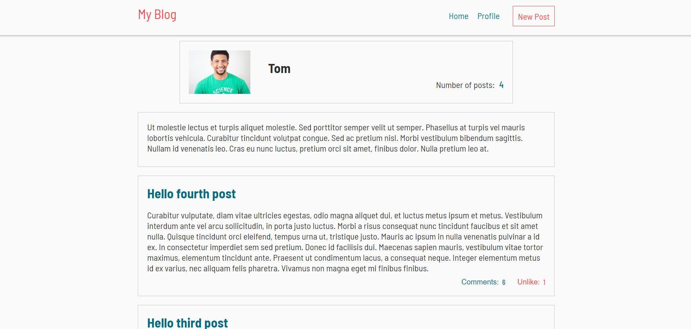
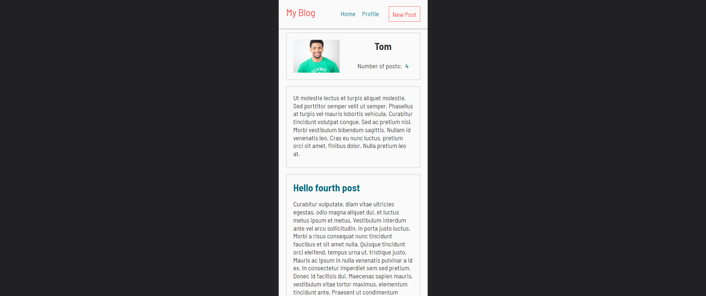

# My Blog App
A blog website that shows the list of posts and empowers readers to interact with them by adding comments and liking posts.

## Features

- The main page display a list of available users.
- Check a user's detailed information by clicking on their card.
- Each user page display the three most recent posts. To see all their posts, click on the *See all posts* button placed at the bottom of the page.
- Each user's post card shows a short part of the actual post. Read the complete post by clicking on its corresponding card.
- Each user's post card also display its *comments counter* and *likes counter*. These are also buttons. Click on them to add comments and likes.
- The logged user is able to create a new post by clicking on the *New Post* button located at the header of the page.
- The header navigator has also a *Profile* button that allow the logged user check its profile. By clicking on the *Home* button, the logged user is redirected to the list of available users. 

## Built With

- Ruby
- Rails

## Getting Started

To get a local copy up and running follow these simple example steps.

### Prerequisites

- Have `git` installed on your local computer.
- Have `ruby` installed on your local computer.
- Have `postgresql` installed on you local computer.

### Install

- Run the commant `git clone https://github.com/gabyse1/my-blog.git` to clone this repository to your local computer. Choose the location you prefer.
- Run the command `bundle install` to install all project's dependencies.

### Usage

- Run the command `rails db:create` to create the app's database.
- Run the command `rails s` to execute the programm.
- Open the url `http://localhost:3000` on a browser.

## Authors

👤 **Gabriela Sánchez Espirilla**

- GitHub: [@gabyse1](https://github.com/gabyse1)
- LinkedIn: [gabyse](https://www.linkedin.com/in/gabyse/)
- Twitter: [@gabyse0](https://twitter.com/gabyse0)

## 🤝 Contributing

Contributions, issues, and feature requests are welcome!

Feel free to check the [issues page](../../issues/).

## Show your support

Give a ⭐️ if you like this project!

## Acknowledgments

- Linters: [Microverse](https://github.com/microverseinc/linters-config)

## 📝 License

This project is [MIT](./LICENSE) licensed.
